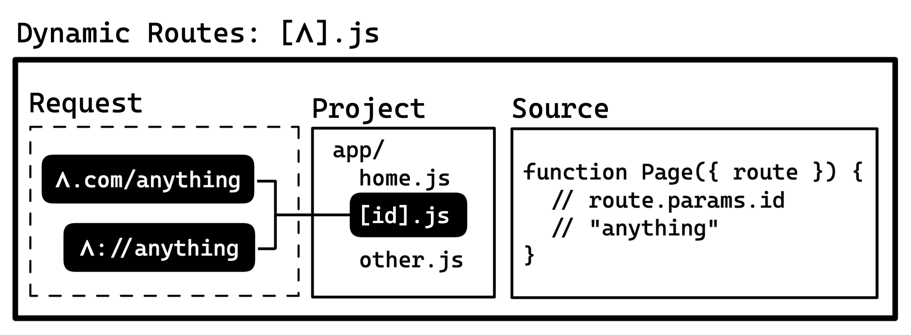
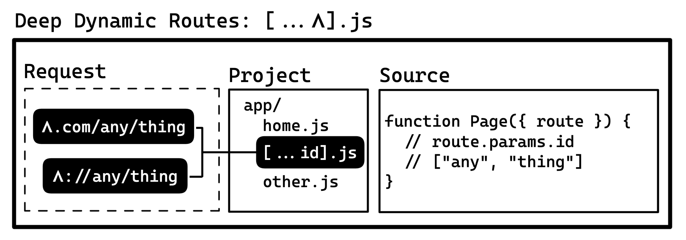

:::warning Beta Release

Expo Router is in the earliest stage of development. The API is subject to breaking changes. The documentation is incomplete and may be inaccurate. The project is not yet ready for production use. Please [contribute to the discussion](https://github.com/expo/router/discussions/1) if you have any ideas or suggestions on how we can improve the convention.

:::



```bash title="File System"
app/
  blog/
    # highlight-next-line
    [id].js # Matches: 𝝠.com/blog/123
```

Dynamic routes match any unmatched path at a given segment level. For example, `/blog/[id]` is a dynamic route. The variable part (`[id]`) is called a "slug". Routes with higher specificity will be matched before a dynamic route. For example, `/blog/bacon` will match `blog/bacon.js` before `blog/[id].js`.

The slug can be accessed from the `route.params.[name]` prop in the component:

```tsx title=app/blog/[id].js
export default function BlogPost({ route }) {
  return (
    <Text>
      // highlight-next-line
      {route.params.id}
    </Text>
  );
}
```

<details>
  <summary>Interoperability</summary>

> By [popular demand](https://twitter.com/Baconbrix/status/1567538444246589441), the dynamic routes pattern is based on the [Next.js dynamic routes](https://nextjs.org/docs/routing/dynamic-routes) system.

There are a couple different ways to implement dynamic routes, here are some existing formats:

| Format              | Framework |
| ------------------- | --------- |
| `/blog/[id].js`     | Next.js   |
| `/blog/[id].svelte` | SvelteKit |
| `/blog/$id.js`      | Remix     |

**Related**

- [Remix](https://remix.run/docs/en/v1/routing/file-system-routing)
- [`react-router`](https://reactrouter.com/web/guides/quick-start)
- [Next.js layouts RFC, pt. 1](https://nextjs.org/blog/layouts-rfc)

</details>

## Deep Dynamic Routes



```bash title="File System"
app/
  blog/
    # highlight-next-line
    [...id].js # Matches: 𝝠.com/blog/123/456
```

Similar to dynamic routes, but the slug matches any number of unmatched path components in a route. For example, `/blog/[...id]` is a deep dynamic route where `[...id]` is the slug. `blog/[...ids].js` will match `/blog/1/2/3`.

:::danger Pending research

This convention is subject to breaking changes.

:::

Directory names can also be deep dynamic routes. For example, `/blog/[...id]/home.js` will match `/blog/1/2/3/home`.

<details>
  <summary>Interoperability</summary>

Deep dynamic routes are functionally analogous to the 'optional catch-all dynamic routes' (`[[...id]].js`) feature from Next.js but the syntax is the same as the 'required catch-all dynamic routes'. Unlike Next.js which has a separate syntax for matching everything except `/`, Expo uses the same syntax for both. If you want to match everything except index, you can add an `index.js` file that has custom handling or you could simply handle the slug differently. We also reserve the term **catch** for error handling.

The convention is also similar to splats in Remix.

</details>

## Priority

Routes with the highest specificity will be matched first. For example a **deep dynamic route** is less specific than a **dynamic route**, which is less specific than a named **route**. The following routes will match in the following order:

```bash title="File System"
app/
  blog/
    index.js # Matches: 𝝠.com/blog/
    hello.js # Matches: 𝝠.com/blog/hello
    [dynamic].js # Matches: 𝝠.com/blog/123
    [...deep].js # Matches: 𝝠.com/blog/123/456
```

:::warning Beta Release

Nested priority may contain bugs. Please report broken configurations to the [expo/router](https://github.com/expo/router/issues) repo.

:::
